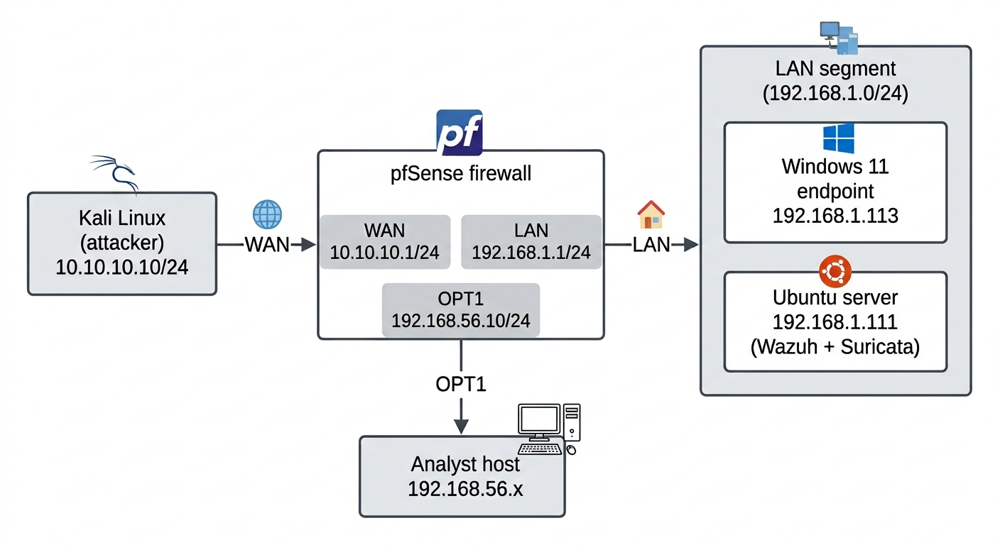

# SOC Detection Lab — Multi-VM Attack Simulation, Segmentation & Multi-Layer Detection

A self-directed home lab built during a SOC analyst internship, simulating real attacks against a small Windows/Linux environment and building the detection pipeline needed to actually see them — then extending that environment with network segmentation and centralized firewall log ingestion.

The goal wasn't just "generate some alerts" — it was to trace, end-to-end, *why* an attack does or doesn't produce a visible alert, and to document every real gap found along the way (including the wrong assumptions and the redundant work), not just the final clean result.

## Architecture



| Role | Detail |
|---|---|
| Attacker | Kali Linux — source of all simulated attack traffic (Nmap recon, Hydra brute-force) |
| Target | Windows 11 — employee-endpoint stand-in, instrumented with Sysmon + Wazuh agent, RDP enabled for the brute-force test |
| SOC stack | Ubuntu — hosts Wazuh (SIEM: manager, indexer, dashboard) and Suricata (network IDS) |
| Firewall/router (Part 2) | pfSense — segments the network into WAN / LAN / a dedicated analyst-access segment (OPT1) |

**Tools:** Oracle VirtualBox · Wazuh 4.9 · Sysmon (SwiftOnSecurity config) · Suricata 7.0.3 + ET Open ruleset (~52,000 rules) + 1 custom rate-based rule · Nmap · Hydra · pfSense

## Part 1 — Three-VM Detection Pipeline

### Reconnaissance (Nmap) — three stacked visibility gaps

An `nmap -sV -T4 -Pn` scan from Kali was silently blocked by Windows Firewall (correct default behavior) but produced **zero alerts** in Wazuh. Diagnosing this surfaced three independent gaps, each of which had to be closed before one blocked connection became a visible alert:

1. **No logging** — Windows doesn't log blocked connections by default. Enabled via `auditpol`, producing Event ID 5157 per blocked connection.
2. **Agent-side filtering** — Wazuh's default agent config explicitly excludes 5157 (a sane noise-reduction default). Removed from the exclusion filter in `ossec.conf`.
3. **No matching rule** — the raw event reached the server, but nothing promotes it to a visible alert without a rule. Wrote custom rule **100010** to flag 5157 as a possible scan/probe.

Re-running the scan produced clean alerts on ports 135/139/445 — a recognizable Windows-enumeration fingerprint (the same surface historically targeted by exploits like EternalBlue).

### Network-layer detection — Suricata's signature-based limit

Suricata runs in IDS/promiscuous mode on the Ubuntu interface, watching wire traffic directly, independent of endpoint logging.

The default ET Open ruleset (~52,000 signatures) did **not** flag the Nmap scan, despite correctly catching unrelated traffic in the same window — because a port scan is a *behavior* across many packets (high rate, many ports, one source), not a fixed single-packet pattern signature engines are built to match.

**Custom behavioral rule:**
```
alert tcp any any -> $HOME_NET any (msg:"CUSTOM Possible port scan detected - high connection rate"; flags:S; detection_filter:track by_src, count 15, seconds 5; sid:1000001; rev:1;)
```
Flags any source sending 15+ SYN packets within 5 seconds — the shape of a fast scan/flood, regardless of packet content. Verified end-to-end: attack traffic → wire-level detection → SIEM ingestion → searchable alert (1,903 hits, correct source/destination).

### False positive & rule tuning

The same rule also fired on ordinary browser traffic to the Wazuh dashboard itself (port 443) — because it counts raw SYN volume only, with no awareness of *which* port. This is a real, known trade-off of behavioral detection: catching unknown/novel patterns costs precision against legitimate bursty traffic.

Fixed with a pass rule excluding dashboard traffic on 443, placed above the detection rule so Suricata's top-down evaluation short-circuits before the counter increments — full scan/brute-force coverage preserved, false positive removed.

### Credential brute-force — Hydra vs. RDP

RDP was enabled specifically to give Hydra a live authentication service to target. Hydra was run from Kali with a small custom password list against RDP.

The same rate-based rule (sid:1000001) generalized correctly and caught the brute-force burst too — proving it detects a *shape* (many fast connections, one source), not a specific attack type. Hydra's own log also showed repeated connection errors mid-run, consistent with Windows RDP's native connection throttling degrading the attack — a built-in defense observed as a side effect, not something configured.

## Part 2 — Network Segmentation & Centralized Firewall Logging

### Introducing pfSense

Replaced the flat network with a routed topology: **WAN** (facing Kali, default-deny inbound), **LAN** (facing Windows + Ubuntu), and **OPT1** (a dedicated host-only segment for analyst access to the Wazuh dashboard via a static route). Kali and Ubuntu were re-addressed onto the new segments; Ubuntu kept a static LAN IP so the SIEM's address stays stable across reboots.

### Nmap through segmentation — a visibility trade-off, not a failure

Re-running the same scan: **999/1000 ports filtered**, only the intentionally-permitted RDP port reachable — segmentation working as intended, confirmed by ~1,000 default-deny entries in pfSense's own log.

Suricata and the Windows-based rule (100010) both saw **nothing** for this scan — and that's the correct outcome, not a gap: pfSense blocks the traffic upstream at WAN, before it ever reaches the LAN segment those tools watch. Segmentation doesn't uniformly increase visibility everywhere — it changes **which layer is authoritative** for a given attack.

### Hydra through segmentation — four corroborating data points

With RDP explicitly permitted through WAN, the brute-force test was re-run and caught independently by all three layers: pfSense's pass log (3 entries), Suricata's custom rule (still firing, unaffected by the network change), and Wazuh's built-in rule **60122** ("Logon Failure") firing 6 times matching Hydra's attempts.

*Correction to the record:* rule 60122 is a Wazuh default rule, not something written for this lab — an earlier assumption treated endpoint-side brute-force detection as an open gap needing a custom rule; verifying the alert's rule ID showed it was already covered out of the box.

### Centralizing pfSense logs into Wazuh

pfSense's own extensive logs were only visible in its own web UI, not searchable centrally. Configured pfSense to forward events to Ubuntu over syslog (confirmed on the wire via `tcpdump`), then hand-wrote a custom decoder/rule pair to parse pfSense's raw log format and promote block/pass events to alerts.

This surfaced two real bugs (a Wazuh-reserved field name that had to be renamed; a regex that broke against legitimately-empty log fields) and one unrelated bug found mid-debugging (a config edit that silently broke the Windows agent's connectivity, root-caused via `ss -tlnp`).

**The actual finding:** once everything was working, testing against a live block event showed the alert that fired wasn't the custom rule at all — it was Wazuh's own **built-in native pfSense decoder/rule (87701)**, which had been parsing the same stream in parallel the entire time. The custom decoder was retired in favor of it. (Kept in [`/retired-custom-pfsense-decoder`](./retired-custom-pfsense-decoder) as a record of the debugging process, not because it's still in use.)

## MITRE ATT&CK Mapping

| Activity | Technique | Detection Source |
|---|---|---|
| Nmap scan (flat network) | T1046 – Network Service Discovery | Wazuh rule 100010 (Event 5157) |
| Nmap scan (segmented network) | T1046 – Network Service Discovery | pfSense default-deny log; Wazuh built-in rule 87701 |
| Port/connection flood pattern | T1595.001 – Active Scanning | Suricata rule sid:1000001 |
| RDP credential brute-force | T1110 / T1021.001 | pfSense pass log; Suricata sid:1000001; Wazuh built-in rule 60122 |
| Network boundary enforcement | NIST CSF DE.CM-1 | pfSense WAN default-deny + centralized syslog |

## Key Findings

- Absence of an alert doesn't mean absence of activity — three independent layers (audit policy, agent-side filtering, rule presence) each had to be fixed before one blocked scan became visible.
- Signature-based IDS is structurally blind to behavior; behavioral rules close that gap at the cost of more false positives on legitimate bursty traffic.
- A rate-based rule detects a *shape* (volume/rate), not intent — it can't alone distinguish scan vs. brute-force vs. legitimate traffic without added port-diversity/destination logic.
- Endpoint-based detection (Wazuh + Sysmon) and network-based detection (Suricata) together give genuine defense-in-depth — both independently caught the same attacks via different mechanisms.
- Segmentation changes *which layer is authoritative* for a given attack rather than uniformly increasing visibility everywhere.
- Checking for existing built-in vendor coverage before hand-building detection is a real time-saver — it's how the redundant custom pfSense decoder was caught and retired.

## Status

All planned detection paths across both the flat and segmented topologies are confirmed working end-to-end. Open, non-blocking follow-ups: confirm Wazuh has a built-in rule for pfSense *pass* (not just block) events; review whether full raw-archive logging can be scaled back; add port-diversity logic to the custom Suricata rule to better separate scan intent from brute-force intent.
